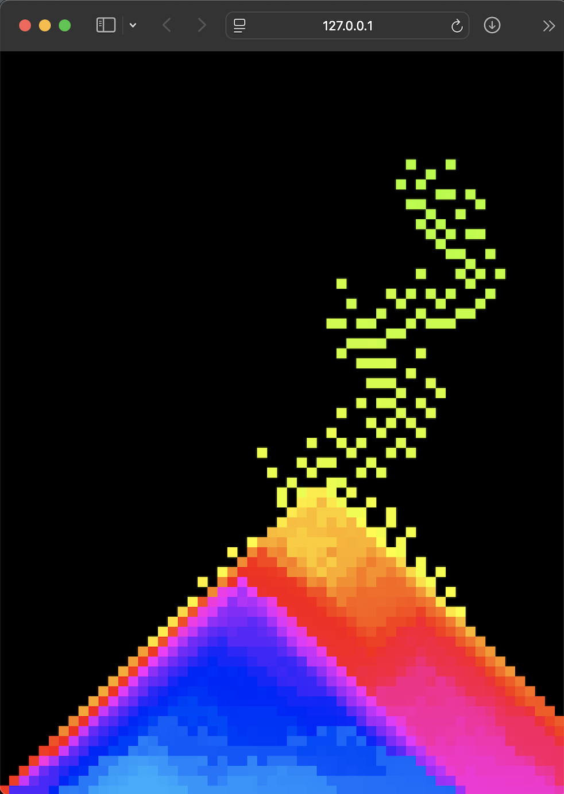

# sand

Tiny p5.js falling-sand sketch — paint colored grains that fall and slide; hue cycles as you draw.

Usage

- Open index.html in a browser or run the server above.
- Drag the mouse on the canvas to paint sand.

Files

- index.html — loader
- sand.js — sketch and simulation
- libraries/ — bundled deps (p5.min.js, p5.sound.min.js, p5.gui.js, quicksettings.js)
- screenshots/ — example outputs

Libraries - p5.js

Preview

| | |
|:---:|:---:|
|  |  |
|  |  |

Future additions
- add gravity to falling sand